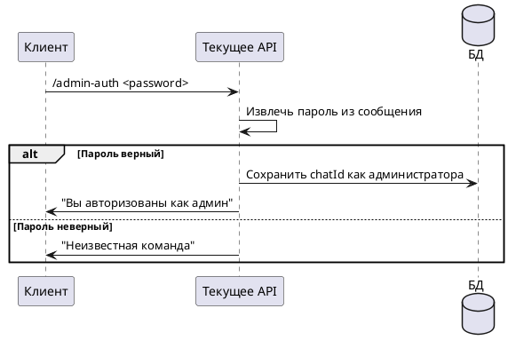

# Команда /admin-auth

## Алгоритм

## Детальное описание алгоритма

1. **Получение команды** — пользователь отправляет `/admin-auth <password>` где `<password>` — пароль администратора
2. **Извлечение пароля** — система извлекает пароль из сообщения (всё после пробела)
3. **Проверка пароля** — пароль сравнивается с `admin.password` из конфигурации:
   - **Если верный** — `chatId` сохраняется в таблицу `admins`, отправляется подтверждение
   - **Если неверный** — отправляется "Неизвестная команда" (для скрытия существования команды)

После успешной авторизации администратор получает доступ к командам:
- `/admin-stats` — статистика бота
- `/admin-errors` — последние ошибки
- `/admin-say` — рассылка сообщений

## Входные параметры

| Параметр | Тип | Источник | Описание |
|----------|-----|----------|----------|
| chatId | Long | Telegram Update | Идентификатор чата пользователя |
| update | Update | Telegram API | Объект обновления от Telegram |
| password | String | Текст сообщения | Пароль администратора |

## Выходные параметры

| Параметр | Тип | Описание |
|----------|-----|----------|
| Сообщение | SendMessage | "Вы авторизованы как админ" ИЛИ "Неизвестная команда" |
