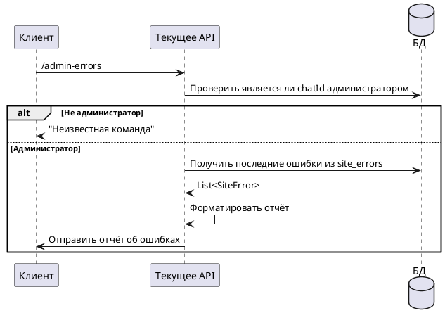

# Команда /admin-errors

## Алгоритм



## Детальное описание алгоритма

1. **Получение команды** — администратор отправляет `/admin-errors`
2. **Проверка прав** — система проверяет наличие `chatId` в таблице `admins`
3. **Если не администратор** — отправляется "Неизвестная команда"
4. **Если администратор** — запрашиваются последние ошибки из таблицы `site_errors`:
   - Типы ошибок: `SITE_UNAVAILABLE`, `AUTH_FAILED`
   - Количество определяется конфигурацией `error-log.last-count`
5. **Форматирование отчёта** — ошибки форматируются в читаемый вид:
   - Дата и время
   - Название сайта
   - Тип ошибки
   - Email пользователя
   - Сообщение об ошибке

## Входные параметры

| Параметр | Тип | Источник | Описание |
|----------|-----|----------|----------|
| chatId | Long | Telegram Update | Идентификатор чата пользователя |
| update | Update | Telegram API | Объект обновления от Telegram |

## Выходные параметры

| Параметр | Тип | Описание |
|----------|-----|----------|
| Сообщение | SendMessage | Отчёт об ошибках ИЛИ "Неизвестная команда" |

### Формат отчёта

```
Последние ошибки (N):

1. 2024-01-15 10:30 | Поликарпова | AUTH_FAILED
   Email: user@example.com
   Ошибка: Invalid credentials

2. 2024-01-15 09:45 | Шаболовка | SITE_UNAVAILABLE
   Email: user2@example.com
   Ошибка: Connection timeout
```
