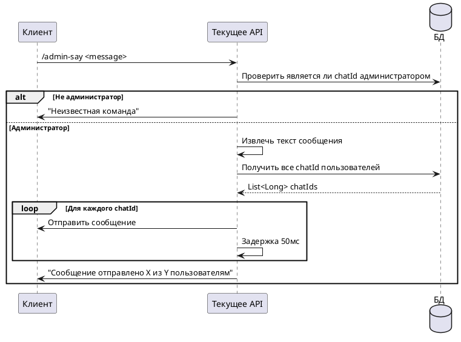

# Команда /admin-say

## Алгоритм

## Детальное описание алгоритма

1. **Получение команды** — администратор отправляет `/admin-say <message>` где `<message>` — текст для рассылки
2. **Проверка прав** — система проверяет наличие `chatId` в таблице `admins`
3. **Если не администратор** — отправляется "Неизвестная команда"
4. **Если администратор**:
   - Извлекается текст сообщения (всё после `/admin-say `)
   - Получаются все `chatId` из таблицы `users`
   - Выполняется рассылка с задержкой 50мс между сообщениями (для избежания rate limit Telegram)
   - Подсчитывается количество успешно отправленных сообщений
5. **Отправка отчёта** — администратору отправляется статистика рассылки

## Входные параметры

| Параметр | Тип | Источник | Описание |
|----------|-----|----------|----------|
| chatId | Long | Telegram Update | Идентификатор чата администратора |
| update | Update | Telegram API | Объект обновления от Telegram |
| message | String | Текст сообщения | Текст для рассылки (после команды) |

## Выходные параметры

| Параметр | Тип | Описание |
|----------|-----|----------|
| Сообщения пользователям | SendMessage | Текст рассылки каждому пользователю |
| Отчёт администратору | SendMessage | "Сообщение отправлено X из Y пользователям" |

## Ограничения

- Задержка 50мс между сообщениями для соблюдения rate limit Telegram API
- При ошибке отправки конкретному пользователю — логируется предупреждение, рассылка продолжается
- При прерывании (InterruptedException) — рассылка останавливается
