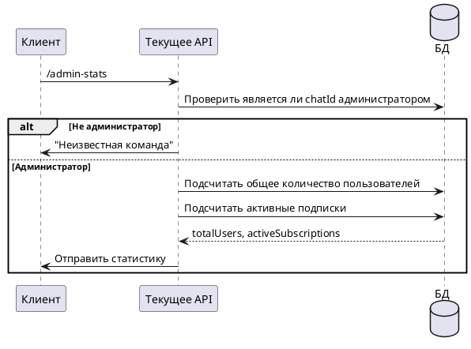

# Команда /admin-stats

## Алгоритм



## Детальное описание алгоритма

1. **Получение команды** — администратор отправляет `/admin-stats`
2. **Проверка прав** — система проверяет наличие `chatId` в таблице `admins`
3. **Если не администратор** — отправляется "Неизвестная команда"
4. **Если администратор**:
   - Запрашивается общее количество пользователей из таблицы `users`
   - Запрашивается количество пользователей с `subscribed = true`
5. **Отправка статистики** — администратору отправляется отчёт

## Входные параметры

| Параметр | Тип | Источник | Описание |
|----------|-----|----------|----------|
| chatId | Long | Telegram Update | Идентификатор чата пользователя |
| update | Update | Telegram API | Объект обновления от Telegram |

## Выходные параметры

| Параметр | Тип | Описание |
|----------|-----|----------|
| Сообщение | SendMessage | Статистика бота ИЛИ "Неизвестная команда" |

### Формат сообщения

```
Статистика:
Всего пользователей: 150
Активных подписок: 120
```
