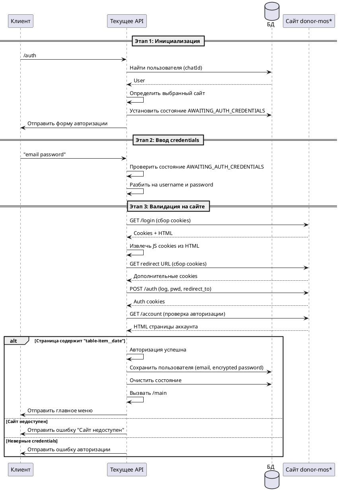

# Команда /auth

## Алгоритм

## Детальное описание алгоритма

### Этап 1: Инициализация

1. **Получение команды** — пользователь отправляет команду `/auth`
2. **Поиск пользователя** — система ищет пользователя в БД по `chatId`
3. **Определение сайта** — если у пользователя выбран сайт `ALL`, отображается "всех центров крови", иначе — конкретный URL сайта
4. **Установка состояния** — в `UserStateStorage` устанавливается состояние `AWAITING_AUTH_CREDENTIALS`
5. **Отправка формы** — пользователю отправляется меню с просьбой ввести credentials в формате: `логин пароль`

### Этап 2: Ввод credentials

1. **Получение сообщения** — пользователь отправляет сообщение в формате `email password`
2. **Проверка состояния** — `AuthUpdateHandler` проверяет, что пользователь находится в состоянии `AWAITING_AUTH_CREDENTIALS`
3. **Парсинг** — сообщение разбивается на две части: `username` (email) и `password`

### Этап 3: Валидация на сайте

Процесс валидации выполняется через `AuthService.isCredentialValid()`:

1. **Определение сайта** — берётся сайт пользователя из БД. Если `ALL`, используется `DONOR_MOS` по умолчанию

2. **Preflight сбор cookies** (`preflightCollectCookies`):
   - GET запрос на страницу логина — сбор `Set-Cookie` заголовков
   - Извлечение JS-куки из HTML (если есть)
   - Переход по JS-редиректу (если есть) — сбор дополнительных cookies
   - Повторный GET на страницу логина — финальный сбор cookies

3. **Отправка авторизации**:
   - POST запрос на `/auth` с параметрами:
     - `log` — email пользователя
     - `pwd` — пароль
     - `redirect_to` — URL страницы аккаунта
   - Сбор авторизационных cookies из ответа

4. **Проверка успешности**:
   - GET запрос на страницу аккаунта с собранными cookies
   - Проверка наличия элемента `table-item__date` в HTML
   - Если элемент найден — авторизация успешна

5. **Retry механизм**:
   - При ошибках сети (`RestClientException`) выполняется до `maxAttempts` попыток
   - Задержка между попытками: `delayMs` миллисекунд
   - После исчерпания попыток выбрасывается `SiteUnavailableException`

### Этап 4: Сохранение и переход

При успешной авторизации:

1. **Шифрование пароля** — пароль шифруется через `EncryptionUtils.encrypt()` с использованием секретного ключа
2. **Сохранение пользователя** — в БД сохраняется:
   - `id` — chatId
   - `email` — логин
   - `password` — зашифрованный пароль
   - `active` — true
   - `site` — выбранный сайт (если не был установлен)
3. **Очистка состояния** — `UserStateStorage.clearState()`
4. **Переход в главное меню** — вызов `/main`

### Обработка ошибок

| Ошибка | Действие |
|--------|----------|
| `SiteUnavailableException` | Отправка меню `siteUnavailable` с названием сайта |
| `AuthFailedException` | Отправка меню `authError` |
| Неверный формат сообщения | Отправка меню `authError` |
| Внутренняя ошибка | Отправка сообщения "⚠️ Произошла внутренняя ошибка. Попробуйте позже." |

## Входные параметры

### Этап 1: Команда /auth

| Параметр | Тип | Источник | Описание |
|----------|-----|----------|----------|
| chatId | Long | Telegram Update | Идентификатор чата пользователя |
| update | Update | Telegram API | Объект обновления от Telegram |

### Этап 2: Ввод credentials

| Параметр | Тип | Источник | Описание |
|----------|-----|----------|----------|
| message | String | Telegram Update | Сообщение в формате "email password" |
| username | String | Парсинг сообщения | Email пользователя |
| password | String | Парсинг сообщения | Пароль в открытом виде |

## Выходные параметры

| Параметр | Тип | Описание |
|----------|-----|----------|
| Сообщение | SendMessage | Главное меню ИЛИ ошибка авторизации |
| Состояние | UserState | Очищено при успехе |
| Данные в БД | User | Сохранённый пользователь с зашифрованным паролем |

## Конфигурация

| Параметр | Описание |
|----------|----------|
| `auth-retry.max-attempts` | Количество попыток при ошибках сети |
| `auth-retry.delay-ms` | Задержка между попытками в миллисекундах |
| `encryption.secret-key` | Ключ для шифрования паролей |
