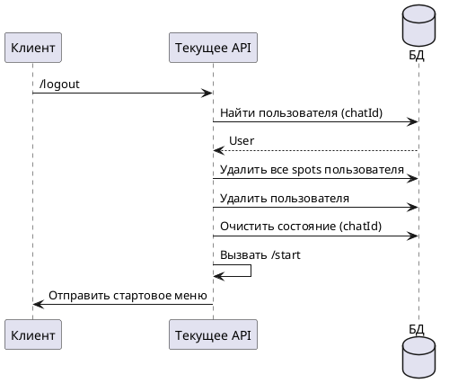

# Команда /logout

## Алгоритм

## Детальное описание алгоритма

1. **Получение команды** — пользователь отправляет команду `/logout`
2. **Поиск пользователя** — система ищет пользователя в БД по `chatId`
3. **Удаление данных** — выполняется каскадное удаление:
   - Удаляются все записи о слотах (`spots`), связанные с пользователем
   - Удаляется сам пользователь из БД
4. **Очистка состояния** — сбрасывается состояние в `UserStateStorage`
5. **Переход к старту** — вызывается команда `/start` для отображения стартового меню

Команда используется для полного удаления данных пользователя из системы.

## Входные параметры

| Параметр | Тип | Источник | Описание |
|----------|-----|----------|----------|
| chatId | Long | Telegram Update | Идентификатор чата пользователя |
| update | Update | Telegram API | Объект обновления от Telegram |

## Выходные параметры

| Параметр | Тип | Описание |
|----------|-----|----------|
| Сообщение | SendMessage | Стартовое меню |
