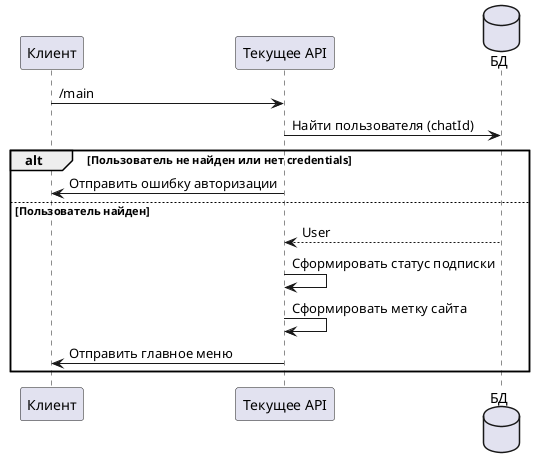

# Команда /main

## Алгоритм

## Детальное описание алгоритма

1. **Получение команды** — пользователь отправляет команду `/main`
2. **Проверка авторизации** — система проверяет:
   - Существует ли пользователь в БД
   - Есть ли у него сохранённые credentials (email и password)
3. **Если не авторизован** — отправляется меню `authError` с предложением авторизоваться
4. **Если авторизован** — формируется главное меню с информацией:
   - **Email** — почта пользователя на сайте donor-mos*
   - **Статус подписки** — "✅ Подписка активна" или "❌ Подписка не активна"
   - **Выбранный сайт** — название медцентра или "Все медцентры" с адресом

## Входные параметры

| Параметр | Тип | Источник | Описание |
|----------|-----|----------|----------|
| chatId | Long | Telegram Update | Идентификатор чата пользователя |
| update | Update | Telegram API | Объект обновления от Telegram |

## Выходные параметры

| Параметр | Тип | Описание |
|----------|-----|----------|
| Сообщение | SendMessage | Главное меню с информацией о пользователе |

### Параметры сообщения (при успешной авторизации)

| Параметр | Пример значения |
|----------|-----------------|
| Email | user@example.com |
| Статус подписки | ✅ Подписка активна |
| Метка сайта | Поликарпова — https://donor-mos.online/account/ |
