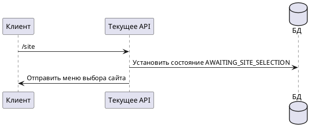

# Команда /site

## Алгоритм

## Детальное описание алгоритма

1. **Получение команды** — пользователь отправляет команду `/site`
2. **Установка состояния** — в `UserStateStorage` устанавливается состояние `AWAITING_SITE_SELECTION`
3. **Отправка меню** — пользователю отправляется меню `chooseSite` с кнопками выбора:
   - **Поликарпова** — donor-mos.online
   - **Шаболовка** — donor-mos-sab.online
   - **Царицыно** — donor-mos-zar.online
   - **Все медцентры** — мониторинг всех сайтов одновременно

После выбора пользователем конкретного сайта, срабатывает соответствующая команда (`/site_donor`, `/site_sab`, `/site_zar` или `/site_all`).

## Входные параметры

| Параметр | Тип | Источник | Описание |
|----------|-----|----------|----------|
| chatId | Long | Telegram Update | Идентификатор чата пользователя |
| update | Update | Telegram API | Объект обновления от Telegram |

## Выходные параметры

| Параметр | Тип | Описание |
|----------|-----|----------|
| Сообщение | SendMessage | Меню выбора сайта с inline-кнопками |
| Состояние | UserState | AWAITING_SITE_SELECTION в UserStateStorage |
