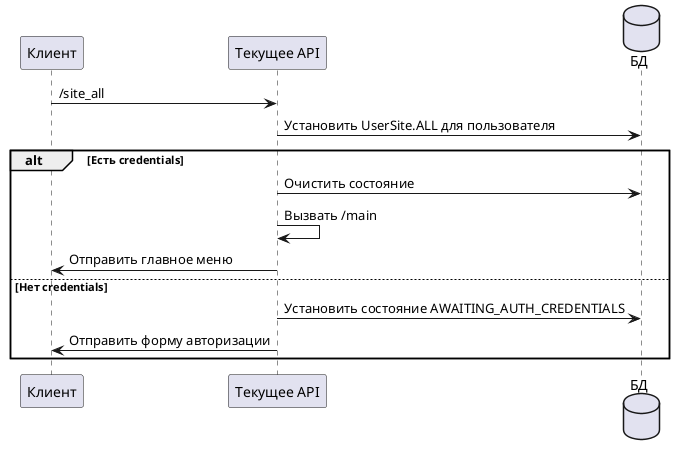

# Команда /site_all

## Алгоритм

## Детальное описание алгоритма

1. **Получение команды** — пользователь выбирает "Все медцентры" в меню выбора сайта
2. **Установка сайта** — в БД для пользователя устанавливается `UserSite.ALL`
3. **Проверка credentials**:
   - **Если credentials есть** — состояние очищается, вызывается `/main` с отображением главного меню
   - **Если credentials нет** — устанавливается состояние `AWAITING_AUTH_CREDENTIALS`, отправляется форма авторизации с текстом "всех центров крови"

При выборе `ALL` система будет мониторить все три сайта одновременно:
- donor-mos.online (Поликарпова)
- donor-mos-sab.online (Шаболовка)
- donor-mos-zar.online (Царицыно)

## Входные параметры

| Параметр | Тип | Источник | Описание |
|----------|-----|----------|----------|
| chatId | Long | Telegram Update | Идентификатор чата пользователя |
| update | Update | Telegram API | Объект обновления от Telegram |

## Выходные параметры

| Параметр | Тип | Описание |
|----------|-----|----------|
| Сообщение | SendMessage | Главное меню ИЛИ форма авторизации |
| Состояние | UserState | Очищено ИЛИ AWAITING_AUTH_CREDENTIALS |
