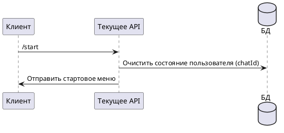

# Команда /start

## Алгоритм

## Детальное описание алгоритма

1. **Получение команды** — пользователь отправляет команду `/start` в Telegram-боте
2. **Очистка состояния** — система очищает текущее состояние пользователя в `UserStateStorage`, сбрасывая любые активные сессии (например, ожидание ввода credentials)
3. **Отправка меню** — через `MenuDispatcher` отправляется стартовое меню с приветственным сообщением и кнопками для дальнейших действий

Команда используется для:
- Первичного знакомства с ботом
- Сброса зависших состояний
- Возврата к началу работы

## Входные параметры

| Параметр | Тип | Источник | Описание |
|----------|-----|----------|----------|
| chatId | Long | Telegram Update | Идентификатор чата пользователя |
| update | Update | Telegram API | Объект обновления от Telegram |

## Выходные параметры

| Параметр | Тип | Описание |
|----------|-----|----------|
| Сообщение | SendMessage | Стартовое меню с кнопками навигации |
