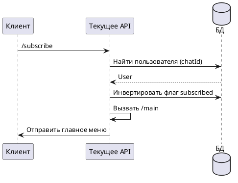

# Команда /subscribe

## Алгоритм

## Детальное описание алгоритма

1. **Получение команды** — пользователь отправляет команду `/subscribe`
2. **Поиск пользователя** — система ищет пользователя в БД по `chatId`
3. **Инверсия подписки** — флаг `subscribed` инвертируется:
   - Если был `true` → становится `false` (отписка)
   - Если был `false` → становится `true` (подписка)
4. **Переход в главное меню** — вызывается команда `/main` для отображения актуального статуса подписки

Подписка влияет на получение уведомлений о новых свободных слотах для сдачи крови.

## Входные параметры

| Параметр | Тип | Источник | Описание |
|----------|-----|----------|----------|
| chatId | Long | Telegram Update | Идентификатор чата пользователя |
| update | Update | Telegram API | Объект обновления от Telegram |

## Выходные параметры

| Параметр | Тип | Описание |
|----------|-----|----------|
| Сообщение | SendMessage | Главное меню с обновлённым статусом подписки |
