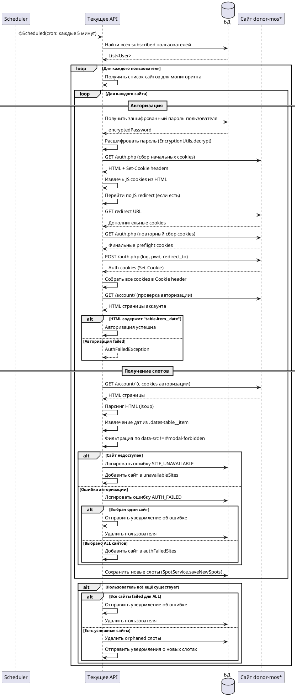

# SpotDonationJob — Поиск свободных слотов

## Алгоритм



## Детальное описание алгоритма

### 1. Запуск по расписанию

Job запускается автоматически по cron-расписанию:
- **Выражение**: `0 */5 * * * *`
- **Периодичность**: Каждые 5 минут
- **Метод**: `pollAllUsers()`

### 2. Получение списка пользователей

```sql
SELECT * FROM users WHERE subscribed = true
```

Система получает всех пользователей с активной подпиской и фильтрует их по флагу `isSubscribed = true`.

### 3. Определение сайтов для мониторинга

Для каждого пользователя определяется список сайтов:

| UserSite | Сайты для проверки |
|----------|-------------------|
| `DONOR_MOS` | [donor-mos.online] |
| `DONOR_MOS_SAB` | [donor-mos-sab.online] |
| `DONOR_MOS_ZAR` | [donor-mos-zar.online] |
| `ALL` | [donor-mos.online, donor-mos-sab.online, donor-mos-zar.online] |

### 4. Процесс авторизации

Для каждого сайта выполняется получение авторизационных cookies через `AuthService.getCookieHeader(user, site)`.

#### 4.1. Расшифровка пароля

```java
String decryptedPassword = EncryptionUtils.decrypt(user.getPassword(), encryptionProperties.getSecretKey());
```

Пароль пользователя расшифровывается из БД с использованием секретного ключа из конфигурации.

#### 4.2. Preflight сбор cookies (preflightCollectCookies)

**Цель**: Собрать необходимые cookies для успешной авторизации. Сайт donor-mos* требует наличия определённых cookies перед отправкой формы логина.

**Шаг 1: Первый запрос на страницу логина**
```
GET {baseUrl}/auth.php
Headers:
  User-Agent: Mozilla/5.0 (Windows NT 10.0; Win64; x64)...
  Accept: text/html,application/xhtml+xml,application/xml;q=0.9,*/*;q=0.8
  Accept-Language: ru-RU,ru;q=0.9,en-US;q=0.8,en;q=0.7
```

Из ответа извлекаются:
- `Set-Cookie` заголовки → добавляются в cookie jar
- HTML body → для извлечения JS cookies

**Шаг 2: Извлечение JS cookies из HTML**

Сайт может содержать JavaScript, который устанавливает cookies:
```html
<script>
document.cookie = "some_cookie=value; path=/";
</script>
```

Метод `HtmlUtils.extractJsCookieFromHtml(body)` парсит HTML и извлекает такие cookies.

**Шаг 3: Переход по JS redirect (если есть)**

Сайт может содержать JavaScript redirect:
```html
<script>
window.location.href = "/some-redirect";
</script>
```

Метод `HtmlUtils.extractJsRedirectFromHtml(body)` извлекает URL redirect.

Если redirect найден:
```
GET {redirectUrl}
Headers:
  User-Agent: Mozilla/5.0...
  Cookie: {собранные cookies}
```

Из ответа извлекаются дополнительные `Set-Cookie` заголовки.

**Шаг 4: Повторный запрос на страницу логина**
```
GET {baseUrl}/auth.php
Headers:
  User-Agent: Mozilla/5.0...
  Cookie: {все собранные cookies}
```

Финальный сбор cookies перед авторизацией.

**Результат preflight**: Cookie jar со всеми необходимыми cookies.

#### 4.3. Отправка формы авторизации

```
POST {baseUrl}/auth.php
Headers:
  User-Agent: Mozilla/5.0...
  Referer: {baseUrl}/auth.php
  Content-Type: application/x-www-form-urlencoded
  Cookie: {preflight cookies}
Body (form-data):
  log: {email}
  pwd: {password}
  redirect_to: {baseUrl}/account/
```

Из ответа извлекаются авторизационные cookies из `Set-Cookie` заголовков.

#### 4.4. Извлечение cookies из тела ответа

Метод `extractBodyCookies` проверяет, содержит ли тело ответа дополнительные cookies в JavaScript:
```java
String kv = HtmlUtils.extractJsCookieFromHtml(body);
if (kv != null) {
    putKeyValue(jar, kv);
}
```

#### 4.5. Формирование Cookie header

Все собранные cookies объединяются в одну строку:
```
cookie1=value1; cookie2=value2; cookie3=value3
```

#### 4.6. Проверка успешности авторизации

```
GET {baseUrl}/account/
Headers:
  User-Agent: Mozilla/5.0...
  Cookie: {все cookies}
```

**Критерий успеха**: HTML ответа содержит элемент с классом `table-item__date`.

```java
String body = accountResp.getBody();
if (body != null && body.contains("table-item__date")) {
    return cookies; // Авторизация успешна
}
```

Если элемент не найден — выбрасывается `AuthFailedException`.

#### 4.7. Retry механизм

При ошибках сети (`RestClientException`) выполняется повторные попытки:

| Параметр | Описание |
|----------|----------|
| `maxAttempts` | Максимальное количество попыток |
| `delayMs` | Задержка между попытками в миллисекундах |

```java
for (int i = 0; i < attempts; i++) {
    try {
        return action.get();
    } catch (RestClientException e) {
        if (i < attempts - 1) {
            Thread.sleep(delayMs);
        }
    }
}
throw new SiteUnavailableException(siteName, lastException);
```

**Важно**: `AuthFailedException` не ретраится — ошибка авторизации не исправится повторной попыткой.

### 5. Запрос страницы аккаунта

```
GET {baseUrl}/account/
Headers:
  User-Agent: Mozilla/5.0 (Windows NT 10.0; Win64; x64)...
  Cookie: {authCookies}
```

Возвращается HTML страница с таблицей доступных слотов.

### 6. Парсинг HTML (SpotUtils.getSpots)

**Структура HTML**:
```html
<div class="dates-table__item table-item">
    <td class="table-item__date">24/05/2024</td>
    <td class="table-item__btn">
        <button data-src="#modal-allowed">Записаться</button>
    </td>
</div>
<div class="dates-table__item table-item">
    <td class="table-item__date">25/05/2024</td>
    <td class="table-item__btn">
        <button data-src="#modal-forbidden">Недоступно</button>
    </td>
</div>
```

**Алгоритм парсинга**:

1. **Поиск элементов** — `Jsoup.parse(html).getElementsByClass("dates-table__item table-item")`
2. **Извлечение даты** — из `<td class="table-item__date">` в формате `dd/MM/yyyy`
3. **Проверка доступности** — анализ атрибута `data-src` у кнопки:
   - `#modal-forbidden` → слот недоступен (пропускается)
   - Любое другое значение → слот доступен (добавляется)
4. **Формирование результата** — список `SpotDTO` с датами доступных слотов

**Логирование разбора**:
```
Spot parse breakdown: elements=10, allowed=3, forbidden=5, noButton=1, noDataSrc=1
```

### 7. Сохранение слотов (SpotService.saveNewSpots)

**Алгоритм синхронизации**:

1. **Получение существующих слотов** — из БД для данного пользователя и сайта
2. **Определение к удалению** — слоты, которые есть в БД, но отсутствуют в новом списке
3. **Определение к добавлению** — слоты, которые есть в новом списке, но отсутствуют в БД
4. **Выполнение операций**:
   - `spotRepository.deleteAll(toDelete)` — удаление устаревших
   - `spotRepository.saveAll(toAddDates)` — добавление новых (с `isSend = false`)

**Пример лога**:
```
Spot sync for user user@example.com (id=123), site=DONOR_MOS: 
  existing=2, parsed=3, added=1, removed=0
```

### 8. Обработка ошибок

#### SiteUnavailableException

При ошибке соединения с сайтом:
1. Логируется в таблицу `site_errors` с типом `SITE_UNAVAILABLE`
2. Сайт добавляется в список `unavailableSites`
3. Обработка продолжается для других сайтов

#### AuthFailedException

При ошибке авторизации:

| Условие | Действие |
|---------|----------|
| Выбран один сайт | Уведомление пользователю → удаление пользователя |
| Выбран ALL сайтов | Логирование → продолжение для других сайтов |

Если при `ALL` все сайты failed — пользователь удаляется.

### 9. Очистка orphaned слотов (SpotService.cleanupOrphanedSpots)

Удаляются слоты, которые относятся к сайтам, больше не отслеживаемым пользователем:

```java
// Пример: пользователь переключился с DONOR_MOS на DONOR_MOS_SAB
// Слоты для DONOR_MOS становятся orphaned и удаляются
```

### 10. Отправка уведомлений (NewSpotHandler.sendNewSpots)

**Получение unsent слотов**:
```sql
SELECT * FROM spots WHERE user_id = ? AND is_send = false
```

**Формат уведомления для одного сайта**:
```
Найдены свободные слоты:

 - 2024-05-24
 - 2024-05-25

Записаться: https://donor-mos.online/account/
```

**Формат уведомления для ALL сайтов**:
```
Найдены свободные слоты:

📍 Поликарпова:
 - 2024-05-24

📍 Шаболовка:
 - 2024-05-25

Записаться: https://donor-mos.online/account/
```

После отправки слоты помечаются `isSend = true`.

## Входные параметры

Job не принимает внешних параметров. Данные извлекаются из БД.

## Выходные параметры

| Параметр | Тип | Описание |
|----------|-----|----------|
| Уведомления | SendMessage | Отправляются пользователям с новыми слотами |
| Логи | SiteError | Записываются в таблицу site_errors при ошибках |
| Слоты | Spot | Сохраняются/обновляются в таблице spots |

## Модель данных Spot

| Поле | Тип | Описание |
|------|-----|----------|
| uuid | String (UUID) | Первичный ключ |
| spotDate | LocalDate | Дата свободного слота |
| isSend | boolean | Флаг отправки уведомления |
| user | User | Связь с пользователем |
| site | UserSite | Сайт, на котором найден слот |

## Конфигурация

| Параметр | Значение | Описание |
|----------|----------|----------|
| cron | `0 */5 * * * *` | Расписание запуска (каждые 5 минут) |
| auth-retry.max-attempts | N | Количество попыток при ошибках сети |
| auth-retry.delay-ms | N | Задержка между попытками в миллисекундах |
| encryption.secret-key | String | Ключ для расшифровки паролей |

## Логирование

| Уровень | Событие |
|---------|---------|
| INFO | Начало/окончание polling |
| INFO | Количество найденных пользователей |
| INFO | Результаты парсинга для каждого сайта |
| INFO | Синхронизация слотов (added/removed) |
| DEBUG | Preflight cookies для сайта |
| DEBUG | Попытки retry при ошибках сети |
| WARN | Сайт недоступен |
| WARN | Ошибка авторизации |
| ERROR | Неожиданная ошибка при обработке |
